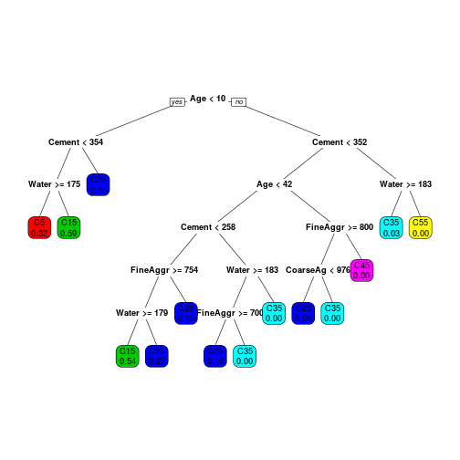

Concrete mixture learning tool
========================================================
author: Peter Prevos, B.Sc, B.A., MBA

date: 5 December 2014

Introduction
========================================================
This application helps civil engineering students to explore the impact of concrete mixture composition and curing age on compression strength based on five variables:
* Curing time [days]
* Water content [l/m3]

***
* Cement content [kg/m3]
* Fine aggregate [kg/m3]
* Coarse Aggregate [kg/m3]

Application Usage
========================================================
The online application illustrates the impact of curing age, water, cement and aggregate content on compression strength. 

Students choose their concrete mixture and curing age, after which the application shows the predicted strength.

***

Decision Model
========================================================
The application is based on a Regression Tree model based on a data set by [Yeh](http://www.sciencedirect.com/science/article/pii/S0008884698001653) (1998).

The model is inaccurate but nevertheless helps beginning students to understand the relationships between curing age and concrete mixture design.

***
 

Conclusion
========================================================
The application is great to provide students a first introduction into the intricacies of designing concrete mixture.

***

